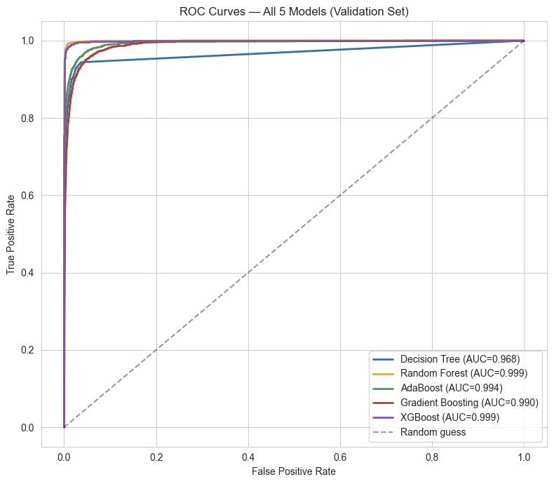
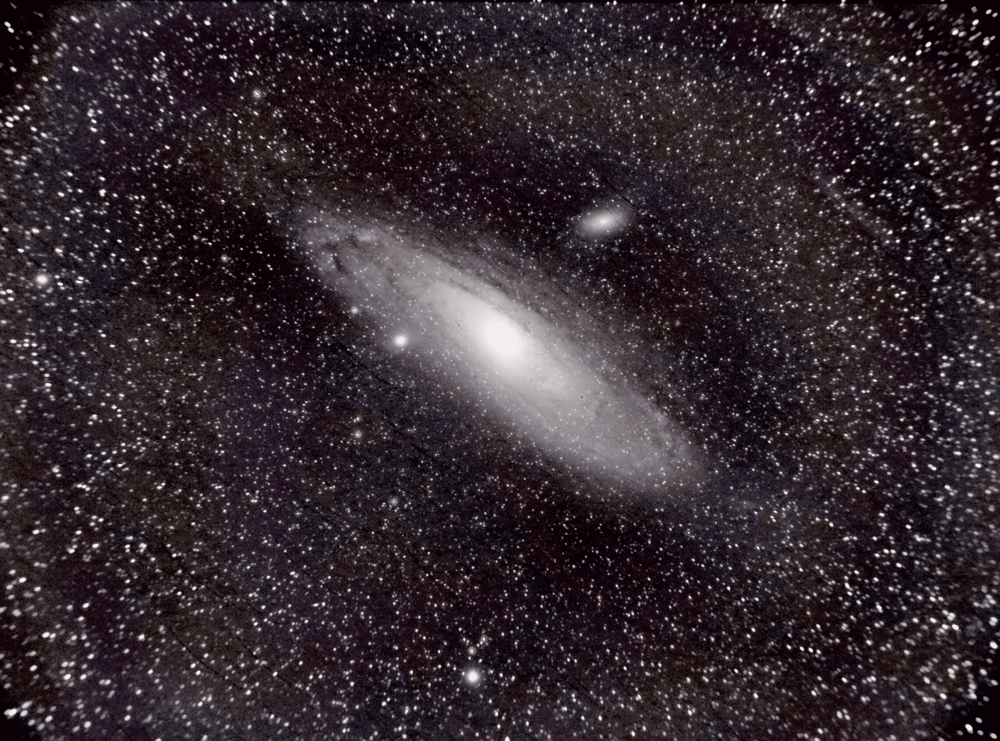

# Astronomy 101 (AE-0918) — Equinox

A semester of coursework spanning statistical modeling on real NASA
satellite data, a Kaggle competition, and hands-on astrophotography —
culminating in a final project that combines machine learning,
LaTeX report writing, and deep-sky image processing.

---

## 🌟 Final Project: Solar Flare Prediction & M31 Astrophotography

The capstone project, spanning three modules: theoretical astrophysics,
a machine learning pipeline for solar flare forecasting, and processed
astrophotography of the Andromeda Galaxy (M31).

**Key result:** Built and tuned five tree-based classifiers (Decision
Tree, Random Forest, AdaBoost, Gradient Boosting, XGBoost) to predict
M5+ solar flares from NASA SDO magnetogram data (SHARP parameters).
The final XGBoost model achieved **F1 = 0.967, PR-AUC = 0.993** on a
validation split — but evaluation on a genuinely held-out, temporally
later test period revealed a **near-total performance collapse
(ROC-AUC ≈ 0.50)**, traced to a real distribution shift: active
regions in the test period were systematically weaker across nearly
every energy/current feature, even among confirmed flares — plausibly
tied to the solar activity cycle. Diagnosing *why* a well-validated
model fails, rather than only reporting that it works, is the part of
this project I'm proudest of.

| | |
|---|---|
|  |  |
| Model comparison (5 algorithms) | Final processed image of M31 |   

**What's inside `final-project/`:**
- `document.pdf` — full write-up (theoretical derivations, ML pipeline, astrophotography workflow)
- `final-project.ipynb` — Colab notebook: EDA → imbalance handling → feature engineering → model tuning → evaluation
- `figures/` — key plots (correlation heatmap, boxplots, ROC comparison)
- `andromeda_final.png` — final M31 image, stacked (DeepSkyStacker) → calibrated & stretched (Siril) → denoised (GIMP)

**Tech stack:** Python, pandas, scikit-learn, XGBoost, imbalanced-learn, matplotlib/seaborn, LaTeX, DeepSkyStacker, Siril, GIMP

---

## 📊 Week 2–3: [Add topic here]

Colab notebook analysis on [describe the dataset/task briefly].

- `week-2/notebook.ipynb`
- `week-3/notebook.ipynb`

---

## 🏆 Week 4: Kaggle Challenge — [Add competition name]

[One or two sentences on the task and approach.]

**Result:** Rank 39, with score of 1.00000

- `week-4-kaggle/notebook.ipynb`
- [Live Kaggle notebook →](https://www.kaggle.com/code/shanky3140/notebook5c7fa3c46e)

---

## Repository Structure

```
.
├── final-project/
│   ├── report.pdf
│   ├── notebook.ipynb
│   ├── figures/
│   └── andromeda_final.png
├── week-2/
│   └── notebook.ipynb
├── week-3/
│   └── notebook.ipynb
└── week-4-kaggle/
    └── notebook.ipynb
```
